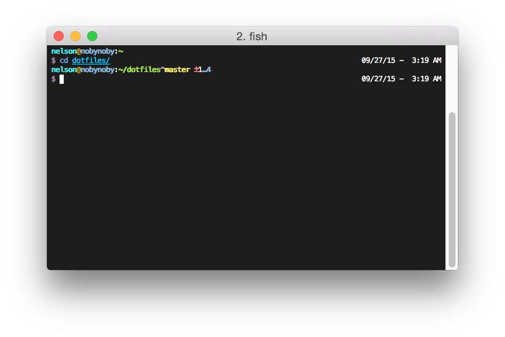

<div align="center">
  <a href="http://github.com/oh-my-fish/oh-my-fish">
  
  </a>
</div>
<br>

> nelsonjchen theme for [Oh My Fish][omf-link]. Based on re5et in Oh-My-Zsh.

## Install

```fish
$ omf u nelsonjchen
```

## Features and Differences

* Pretty colors
* Two line prompt
* Git Prompt using off-the-shelf fish functions
  * Note that the symbology, colors, and features are more than the `zsh` version and they don't match up 1-to-1. For example, checking out a tag will show the tag name in `fish` but the re5et version in `zsh` will simply show the commit ID. This was one such freebie amongst many I just left in while porting since the `fish` script was giving it to me for free anyway. It is still pretty close though.
* Red user prompt if `root`
* 12 hour clock
  * re5et: 24 hour clock
* MM DD YY date format
  * re5et: YY MM DD date format
* Title Setting to the `prompt_pwd` function in fish for screen, tmux, and non-terminal multiplexer.
  * This is derived from [@chgu82837's theme](https://github.com/chgu82837/theme-PastFish/blob/39af8e2885e308501bb0afa9dedab193a8722cfe/fish_prompt.fish#L82-L90)

## Omissions from the re5et version

* Trimming down the working directory display only works on `~`. The original re5et prompt would also trim based on the current environment variables set. For example, if you had the environment variable `FOO` set to `/usr/local` and you did `cd /usr/local`, you would see `$FOO/` in the prompt as the current working directory. I'm not sure how I would get this working. `fish` does appear to have a condensation function but it goes beyond simple environment variable replacement and I can't figure out how to turn it off.

## Screenshot

<p align="center">

</p>

# License

[MIT][mit] © [Nelson Chen][author] et [al][contributors]


[mit]:            http://opensource.org/licenses/MIT
[author]:         http://github.com/nelsonjchen
[contributors]:   https://github.com/nelsonjchen/omf-theme-nelsonjchen/graphs/contributors
[omf-link]:       https://www.github.com/oh-my-fish/oh-my-fish

[license-badge]:  https://img.shields.io/badge/license-MIT-007EC7.svg?style=flat-square
[travis-badge]:   http://img.shields.io/travis/nelsonjchen/omf-theme-nelsonjchen.svg?style=flat-square
